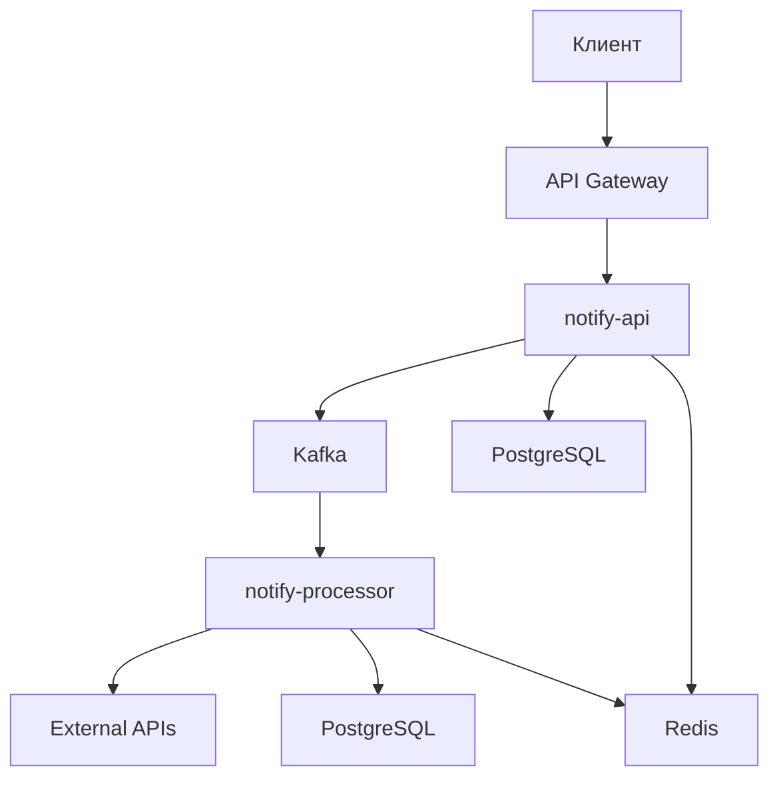

# NotifySender
## Асинхронная система по отправке уведомлений на основе микросервисной архитектуры
## Стек
- Java 21
- Spring Boot 4.0.6
- Apache Kafka
- Redis
- PostgreSQL 15
- Consul(Service Mesh)
- Spring Cloud(API Gateway)
- Testcontainers

NotifySender предоставляет пользователю более удобный способ взаимодействовать с шлюзами коммуникации(SMS, Email, Push).
Представляет из себя Anti-corruption layer между сервисами доставки уведомлений и пользователем.
С помощью микросервисной архитектуры NotifySender обладает повышенной отказоустойчивостью при самых неожиданных ситуациях.

# Запуск
## 1. Создать файл .env по примеру .env.example, затем заполнить значения
```bash
cat > .env << EOF
POSTGRES_USER=
POSTGRES_PASSWORD=
API_DB=
PROCESS_DB=
SMSRU_API_KEY=
UNISENDER_API_KEY=
ADMIN_API_KEY=
EOF
```
## 2. (Опционально для Push канала)
Переименовать JSON-файл Firebase Admin SDK private key в firebase-service-account.json и переместить в notify-processor/src/main/resources/
## 3. Запустить систему
```bash
docker-compose up -d
```
Первый запуск длится ~400 секунд, после 30-40 секунд
## 4. Отправить запрос
```bash
curl -X POST http://localhost:8080/api/notify/sms \
  -H "Content-Type: application/json" \
  -H "X-API-Key: <API-ключ>" \
  -d '{"userPhone": "+79991234567", "targetPhone": "+79992345678", "content": "Hello, World!"}'
```
# Мониторинг
## 1. Перейдите в Grafana по следующей ссылке
```bash
http://localhost:3000
```
## 2. Настройте дашборд используя следующие метрики:
- notifications_consumed_total (Метрика принятых consumer сообщений)
- kafka_consumer_lag (Лаги при доставке kafka)
- gateway_requests (Количество поступивших запросов)
- queue_size (Состояние очереди уведомлений к отправке на внешний api. Обновляется раз в 5 секунд)