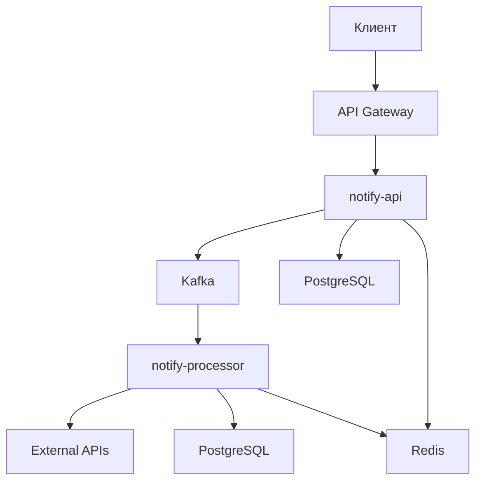

# NotifySender
## Асинхронная система по отправке уведомлений на основе микросервисной архитектуры
## Стек
- Java 21
- Spring Boot 4.0.6
- Apache Kafka
- Redis
- PostgreSQL 15
- Consul(Service Mesh)
- Spring Cloud(API Gateway)
- Testcontainers

NotifySender предоставляет пользователю более удобный способ взаимодействовать с шлюзами коммуникации(SMS, Email, Push).
Представляет из себя Anti-corruption layer между сервисами доставки уведомлений и пользователем.
С помощью микросервисной архитектуры NotifySender обладает повышенной отказоустойчивостью при самых неожиданных ситуациях.

# Запуск
## 1. Запустить систему
```bash
docker-compose up -d
```
## 2. Отправить запрос
```bash
curl -X POST http://localhost:8080/api/notify/sms \
  -H "Content-Type: application/json" \
  -d '{"userPhone": "+79991234567", "targetPhone": "+79992345678", "content": "Hello, World!", "senderId": "sender"}'
```